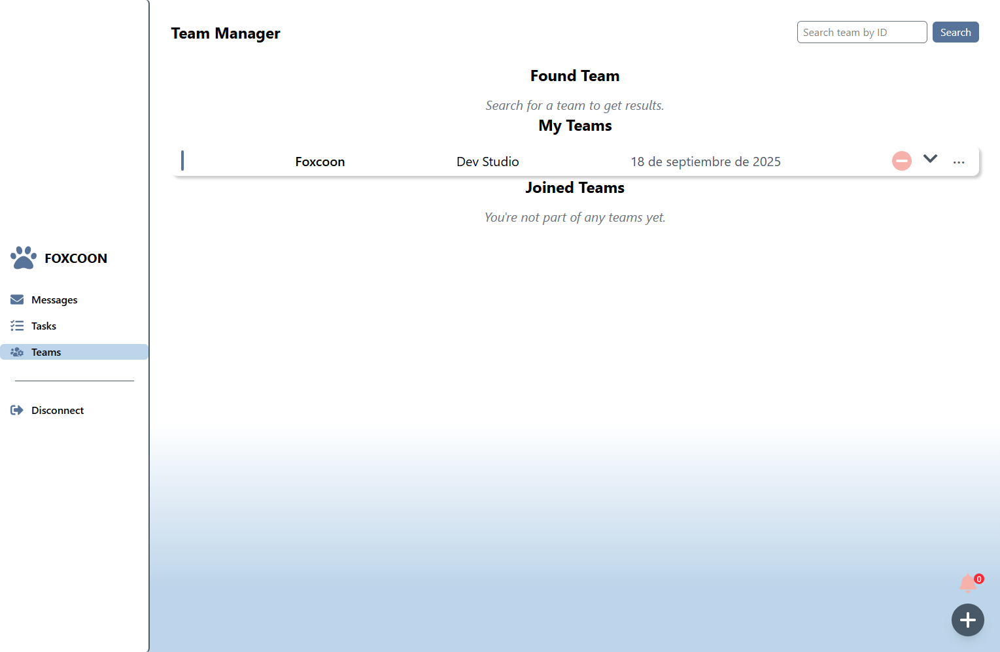
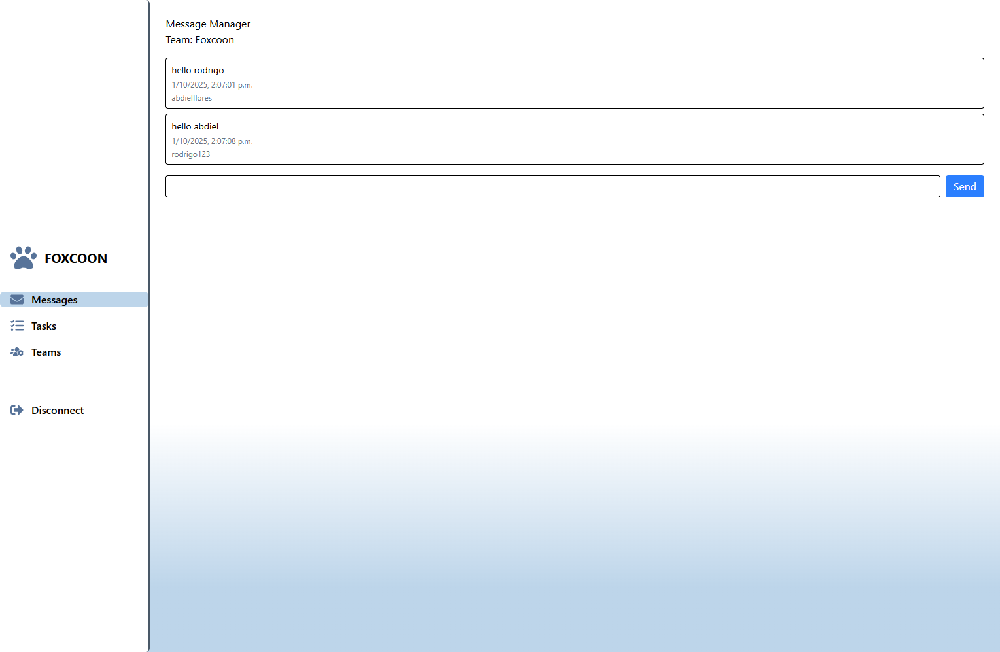

# 🚀 CRM Cluster

**CRM Cluster** is a full-stack Customer Relationship Management (CRM) system developed by **Abdiel Flores**.  
It’s designed to help freelancers and small businesses efficiently manage their clients, tasks, and communication.

---

## 🎯 Features

- 👥 Team management with roles (Admin, Editor, Viewer)
- ✅ Individual and coop tasks management
- 💬 Real time messages (WebSockets)
- 🔔 Notifications for every action in real time
- 🔐 JWT + Role-based access control authentication
- 📊 Statistics

---

## 🛠️ Tech Stack

### Frontend

- React + Vite
- Tailwind CSS
- Socket.io-client

### Backend

- Express
- MySQL2
- JSON Web Token (JWT)
- Socket.io

### Deployment

- Vercel (Frontend)
- Render (Backend)
- Railway (Database)

## 🚀 Demo

🔗 [Watch Demo](https://crm-cluster.vercel.app)
🔗 [Watch Demo Video](https://www.youtube.com/watch?v=CSGETC9ozto)
👤 Create your own user

---

## 📂 Project Structure

```
crm-cluster
.
├── CRM_Cluster_README.md
├── LICENSE
├── client
│   ├── README.md
│   ├── eslint.config.js
│   ├── index.html
│   ├── package-lock.json
│   ├── package.json
│   ├── public
│   │   ├── logo.svg
│   │   └── vite.svg
│   ├── src
│   │   ├── App.jsx
│   │   ├── assets
│   │   │   ├── hero-image.jpg
│   │   │   ├── logo.svg
│   │   │   └── react.svg
│   │   ├── components
│   │   │   ├── coopSidebar
│   │   │   │   ├── CoopSideBar.jsx
│   │   │   │   ├── CoopSideBarItem.jsx
│   │   │   │   └── Layout.jsx
│   │   │   ├── core
│   │   │   │   ├── CoopNotificationBar.jsx
│   │   │   │   ├── NotificationBar.jsx
│   │   │   │   └── ProtectedRoute.jsx
│   │   │   ├── home
│   │   │   │   └── FeatureCard.jsx
│   │   │   ├── messages
│   │   │   │   └── MessageBox.jsx
│   │   │   ├── sidebar
│   │   │   │   ├── Layout.jsx
│   │   │   │   ├── SideBar.jsx
│   │   │   │   └── SideBarItem.jsx
│   │   │   ├── tasks
│   │   │   │   ├── AddTaskButton.jsx
│   │   │   │   ├── AddTaskForm.jsx
│   │   │   │   ├── DeleteConfirmModal.jsx
│   │   │   │   ├── FilterChart.jsx
│   │   │   │   ├── FilterPanel.jsx
│   │   │   │   ├── README.taskManager.md
│   │   │   │   ├── TaskChart.jsx
│   │   │   │   ├── TaskManagerBase.jsx
│   │   │   │   └── UpdateTaskForm.jsx
│   │   │   └── teams
│   │   │       ├── AddTeamButton.jsx
│   │   │       ├── AdminUserChart.jsx
│   │   │       ├── CreateTeamForm.jsx
│   │   │       ├── DeleteModal.jsx
│   │   │       ├── JoinedTeamChart.jsx
│   │   │       ├── MyTeamsChart.jsx
│   │   │       ├── NotificationButton.jsx
│   │   │       ├── NotificationModal.jsx
│   │   │       ├── TeamChart.jsx
│   │   │       ├── UpdateTeamForm.jsx
│   │   │       ├── UpdateUserForm.jsx
│   │   │       └── UserChart.jsx
│   │   ├── config.js
│   │   ├── context
│   │   │   ├── AuthContext.jsx
│   │   │   ├── BarSignalContext.jsx
│   │   │   └── TeamContext.jsx
│   │   ├── core
│   │   │   ├── logWrapper.js
│   │   │   └── socketInstance.js
│   │   ├── hooks
│   │   │   ├── coopTasks
│   │   │   │   ├── useCoopTaskActions.js
│   │   │   │   ├── useCoopTaskFetcher.js
│   │   │   │   └── useCoopTaskFilters.js
│   │   │   ├── global
│   │   │   │   └── formatDate.js
│   │   │   ├── messages
│   │   │   │   ├── service.js
│   │   │   │   ├── useMessageActions.js
│   │   │   │   └── useMessageManager.js
│   │   │   ├── tasks
│   │   │   │   ├── useTaskActions.js
│   │   │   │   ├── useTaskFetcher.js
│   │   │   │   └── useTaskFilters.js
│   │   │   └── teams
│   │   │       ├── modalHook.js
│   │   │       ├── service.js
│   │   │       ├── useTeamActions.js
│   │   │       └── useTeamManager.js
│   │   ├── index.css
│   │   ├── main.jsx
│   │   ├── pages
│   │   │   ├── auth
│   │   │   │   ├── LoginPage.jsx
│   │   │   │   └── RegisterPage.jsx
│   │   │   ├── connection
│   │   │   │   ├── ConnectPage.jsx
│   │   │   │   └── DisconnectPage.jsx
│   │   │   ├── coopTasks
│   │   │   │   └── CoopTaskManager.jsx
│   │   │   ├── home
│   │   │   │   ├── AboutPage.jsx
│   │   │   │   └── HomePage.jsx
│   │   │   ├── messages
│   │   │   │   └── MessageManager.jsx
│   │   │   ├── tasks
│   │   │   │   └── TaskManager.jsx
│   │   │   └── teams
│   │   │       └── TeamManager.jsx
│   │   └── services
│   │       ├── coopTaskService.js
│   │       └── taskService.js
│   ├── vercel.json
│   └── vite.config.js
├── package-lock.json
├── package.json
└── server
    ├── app.js
    ├── apps
    │   ├── TasksColab
    │   │   ├── controller.js
    │   │   └── taskService.js
    │   ├── auth
    │   │   ├── controller.js
    │   │   ├── routes.js
    │   │   └── service.js
    │   ├── connections
    │   │   ├── controller.js
    │   │   ├── routes.js
    │   │   └── socket.js
    │   ├── customers
    │   │   ├── controller.js
    │   │   ├── model.js
    │   │   ├── routes.js
    │   │   └── service.js
    │   ├── messages
    │   │   ├── controller.js
    │   │   └── messagesService.js
    │   ├── tasks
    │   │   ├── controller.js
    │   │   ├── routes.js
    │   │   └── service.js
    │   ├── teams
    │   │   ├── controller.js
    │   │   └── teamsService.js
    │   └── users
    │       ├── controller.js
    │       └── routes.js
    ├── core
    │   ├── config
    │   │   ├── envData.js
    │   │   └── index.js
    │   ├── database
    │   │   └── connection.js
    │   ├── middleware
    │   │   ├── cors.js
    │   │   ├── validateRole.js
    │   │   ├── validateSocketGlobalRole.js
    │   │   ├── validateSocketTeamRole.js
    │   │   ├── validateSocketToken.js
    │   │   ├── validateToken.js
    │   │   ├── withGlobalRole.js
    │   │   ├── withTaskRole.js
    │   │   └── withTeamRole.js
    │   ├── services
    │   │   └── mailer.js
    │   └── validation
    │       └── tasks
    │           └── validators.js
    ├── index.js
    ├── jest.config.js
    ├── logWrapper.js
    ├── package-lock.json
    ├── package.json
    └── tests
        ├── serverValidation
        │   └── socketHarness.js
        ├── taskValidation
        │   └── validators.test.js
        └── teamsValidation
            ├── teamCreateValidation.test.js
            ├── teamDeleteValidation.test.js
            └── teamUpdateValidator.test.js
```

---

## 🚧 Upcoming Features (To-do)

- [ ] Dashboard
- [ ] Customer manager

---

## 🧑‍💻 Author

Developed by **Abdiel Flores**  
Software Engineering student focused on building modular, functional tools that solve real-world problems.  
Inspired by clarity, logic, and the power of well-designed systems.

---

## 🏗️ Architecture

- Client and Server are separated in the same repo
- Modular Backend by features (auth, tasks, teams, messages)
- Custom hooks with reusable logic
- API context for global state
- Personalized Middleware for validation with roles

## 📜 License

MIT License – Feel free to use, modify, and contribute.

## 📸 Screenshots





## ⚙️ Quick Start

# Clone the repo

git clone https://github.com/abdiel-code/crm-cluster

# Install dependencies

cd crm-cluster/client && npm install
cd ../server && npm install

# Run frontend and backend

npm run dev # or your custom script
